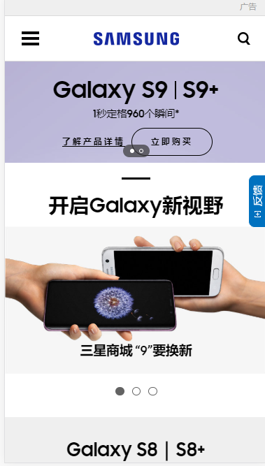

# 微金锁项目

## 1  响应式布局

使用一套代码，可以在不同的设备(主要指屏幕的宽度)之间显示，并且提供友好的用户体验。

如：三星中国这个网站，屏幕宽度不同的时候，会自动切换样式以适应不同的设备

**PC端**


**移动端**



### 1.1  核心原理

> 响应式布局核心的原理是使用了css3中的**媒体查询**

## 2  响应式布局

是一种css语法，可以根据设备的不同（主要是屏幕的宽度不同）,去加载对应的css代码

我们只需要理它的作用，而代码是不用去记的。拿来修改即可使用。

### 2.1  初体验

以下代码分别在宽度400px，600px，800px的屏幕下显示的是不同颜色！

1. 在css中写入媒体查询的代码`@media screen and (width:xxx)`除了xxx之外，其他都是关键字
2. 只有当屏幕的宽度满足**width:值**条件时，才会去加载里面的css代码

```css
<style>
/* 800px body->red */

@media screen and (width:800px) {
  body {
    background-color: red;
  }
}

/* 600px body->blue */

@media screen and (width:600px) {
  body {
    background-color: #0094FF;
  }
}
</style>
```


### 2.2  媒体类型（了解）

> 媒体类型可以理解为不同的设备i，如打印机，计算机的屏幕等。可以加载不同的媒体类型，一般时**screen**使用得最多

- all 匹配所有的媒体类型，默认值
- screen 匹配计算机显示器
- print 匹配打印机设备

```css
/* 匹配所有的媒体类型 */
@media all {
  body {
    background-color: red;
  }
}

/* 匹配屏幕 */
@media screen {
  body {
    background-color: red;
  }
}

/* 匹配打印机 */
@media print {
  body {
    background-color: red;
  }
}
```

### 2.3 媒体特性（了解）

> 可以根据屏幕的宽度，高度等参数进行查询。这些参数就叫做媒体特性。

- width-宽度
- min-width 最少宽度
- max-width 最大宽度
- height 高度
- min-height 最少高度
- max-height 最大高度
- aspect-ratio 视口的宽高比
- min-aspect-ratio 最少宽高比
- max-aspect-ratio 最大宽高比

```css
<style>
/* >=800px body=>#0094FF */
@media screen and (min-width:800px) {
  body {
    background-color: #0094FF;
  }
}

/* <800px body=>pink */
@media screen and (max-width:800px) {
  body {
    background-color: pink;
  }
}
</style>
```

### 2.4  媒体关键字（了解）

- not 取反
- only  实现更好的兼容
- and 连接
- or 或者

```css
 /* 取反 屏幕宽度不为800px的时候 被选中 */
@media not screen and (width:800px){
  body{
    background-color: red;
  }
}
/* only 更好的兼容 屏幕为800px的时候被选中 */
@media only screen and (width:800px){
  body{
    background-color: red;
  }
}

/* or 代码中体现为 逗号(,)  意思屏幕为800px或者600px的时候被选中 */
@media screen and (width:800px),screen and (width:600px) {
  body{
    background-color: green;
  }
}
```

### 2.5  媒体查询引入方式

- **style**标签里或者css文件中
- **style标签上**
- link标签上

```html
<!-- 在style标签里或者在css文件里写媒体查询  -->
<style>
  @media screen and (width:800px) {
    body {
      background-color: red;
    }
  }
</style>

<!-- 在style标签上通过属性的方式写媒体查询 -->
<style media="screen and (width:800px)">
  body {
    background-color: red;
  }
</style>

<!-- 在link标签写媒体查询 -->
<link rel="stylesheet" media="screen and (width:800px)"  href="./base.css">
```

## 3  响应式框架Bootstrap

**Bootstrap**是最受欢迎的HTML、CSS和JS框架，用于开发响应式布局、移动设备优先的WEB项目

### 3.1  在线地址

[在线中文官网](http://www.bootcss.com/)

[下载地址](http://v3.bootcss.com/getting-started/#download)


### 3.2  初学者模板

> 务必用最新的设计和开发标准武装你的页面。这意味着使用 HTML5 doctype 声明、添加一个 `viewport` 标签让页面正确支持响应式布局。将这些整合在一起后，你的页面应当像下面这样：

```html
<!doctype html>
<html lang="en">
  <head>
    <!-- Required meta tags -->
    <meta charset="utf-8">
    <meta name="viewport" content="width=device-width, initial-scale=1, shrink-to-fit=no">

    <!-- Bootstrap CSS -->
    <link rel="stylesheet" href="https://cdn.bootcss.com/bootstrap/4.0.0/css/bootstrap.min.css" integrity="sha384-Gn5384xqQ1aoWXA+058RXPxPg6fy4IWvTNh0E263XmFcJlSAwiGgFAW/dAiS6JXm" crossorigin="anonymous">

    <title>Hello, world!</title>
  </head>
  <body>
    <h1>Hello, world!</h1>

    <!-- Optional JavaScript -->
    <!-- jQuery first, then Popper.js, then Bootstrap JS -->
    <script src="https://cdn.bootcss.com/jquery/3.2.1/jquery.slim.min.js" integrity="sha384-KJ3o2DKtIkvYIK3UENzmM7KCkRr/rE9/Qpg6aAZGJwFDMVNA/GpGFF93hXpG5KkN" crossorigin="anonymous"></script>
    <script src="https://cdn.bootcss.com/popper.js/1.12.9/umd/popper.min.js" integrity="sha384-ApNbgh9B+Y1QKtv3Rn7W3mgPxhU9K/ScQsAP7hUibX39j7fakFPskvXusvfa0b4Q" crossorigin="anonymous"></script>
    <script src="https://cdn.bootcss.com/bootstrap/4.0.0/js/bootstrap.min.js" integrity="sha384-JZR6Spejh4U02d8jOt6vLEHfe/JQGiRRSQQxSfFWpi1MquVdAyjUar5+76PVCmYl" crossorigin="anonymous"></script>
  </body>
</html>
```

> 以上这些就是所有页面必须的。请访问 [布局](https://v4.bootcss.com/docs/4.0/layout/overview/) 或 [官方实例](https://v4.bootcss.com/docs/4.0/examples/) 以作参考，然后就可以开始布局你的网站内容和组件了。

### 3.3  栅格系统

> 栅格系统按照移动规则把div的纵向排列改为类似表格的排列形式。

[官网关于网格系统的解释](https://v4.bootcss.com/docs/4.0/layout/grid/)

#### 3.3.1  四种宽度不同的屏幕

- 极小屏幕 xs 小于等于768px 手机设备
- 小屏幕 sm 768px ~992px 平板电脑
- 中等(普通)屏幕 md 992px~1200px - 老旧的电脑显示器
- 大屏 lg 大于1200px 大的电脑显示器

#### 3.3.2  编写栅格系统的步骤

- 版心容器 .container或者 .container-fluid
- 行 .row
- 栅格代码   col-(屏幕种类)-份数  如  col-xs-11

```html
<!-- 1 写大容器 .container-fluid -->
<div class="container-fluid">
  <!-- 2 写行 .row -->
  <div class="row">
    <h1>col-xs-1 一列占一份 一共 12份</h1>
    <!-- 3 写栅格 -->
    <div class="col-xs-1">.col-xs-1</div>
    <div class="col-xs-1">.col-xs-1</div>
    <div class="col-xs-1">.col-xs-1</div>
    <div class="col-xs-1">.col-xs-1</div>
    <div class="col-xs-1">.col-xs-1</div>
    <div class="col-xs-1">.col-xs-1</div>
    <div class="col-xs-1">.col-xs-1</div>
    <div class="col-xs-1">.col-xs-1</div>
    <div class="col-xs-1">.col-xs-1</div>
    <div class="col-xs-1">.col-xs-1</div>
    <div class="col-xs-1">.col-xs-1</div>
    <div class="col-xs-1">.col-xs-1</div>
  </div>
</div>

<!-- jQuery (Bootstrap 的所有 JavaScript 插件都依赖 jQuery，所以必须放在前边) -->
<script src="https://cdn.bootcss.com/jquery/1.12.4/jquery.min.js"></script>
<!-- 加载 Bootstrap 的所有 JavaScript 插件。你也可以根据需要只加载单个插件。 -->
<script src="https://cdn.bootcss.com/bootstrap/3.3.7/js/bootstrap.min.js"></script>
```

**补充：**

- 容器提供了一种中心和水平填充站点内容的方法。使用`.container`了应答像素宽度或`.container-fluid`用于`width: 100%`在所有视窗和器件尺寸。